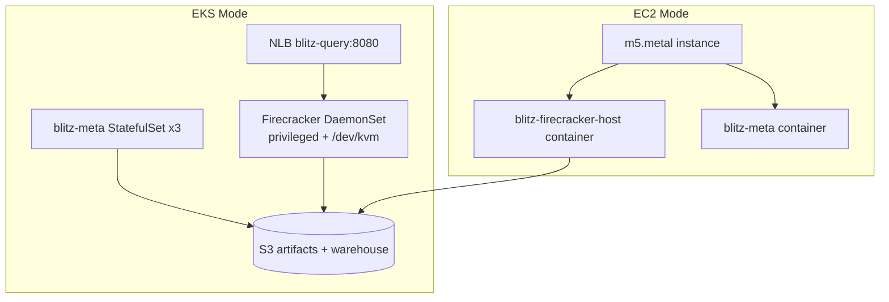

# Blitz on AWS — Deployment Guide

Alpheidae runs Firecracker microVMs for query execution and a replicated
`blitz-meta` catalog for Iceberg metadata. On AWS, **Firecracker requires bare-metal
EC2** (KVM is not available on regular instances).

Two deployment modes:

| Mode | When to use | Components |
|------|-------------|------------|
| **`eks`** (preferred) | You want Kubernetes orchestration | EKS + meta StatefulSet + Firecracker DaemonSet on bare-metal nodes |
| **`ec2`** (fallback) | Simpler/cheaper dev, no K8s | Single bare-metal EC2 with Docker |

## Architecture



### Why bare metal?

Firecracker talks directly to `/dev/kvm`. AWS only exposes KVM on **metal**
instance types (`m5.metal`, `i3.metal`, `c5.metal`, etc.). There is no
nested-virtualization workaround on standard EC2.

### Why EKS over plain EC2?

- **EKS**: meta catalog HA (3-node StatefulSet), rolling updates, LoadBalancer
  for query ingress, separate scaling of catalog vs compute
- **EC2**: one box, no $73/mo EKS control-plane fee, faster to stand up for dev

## Cost estimate (dev, us-east-1 on-demand)

| Resource | EKS mode | EC2 mode |
|----------|----------|----------|
| EKS control plane | ~$73/mo | — |
| 2× t3.medium (meta) | ~$60/mo | — |
| 1× m5.metal (Firecracker) | ~$2,976/mo | ~$2,976/mo |
| NAT gateway | ~$32/mo | ~$32/mo |
| S3 + data transfer | ~$5/mo | ~$5/mo |
| **Total** | **~$3,150/mo** | **~$3,015/mo** |

Bare metal dominates cost. For experiments, terminate when idle or explore
Spot (limited availability for metal).

## Prerequisites

- AWS CLI configured (`aws configure`)
- Terraform ≥ 1.5
- For EKS mode: `kubectl`, Docker
- A **KVM-capable Linux builder** to create golden snapshots (bare-metal EC2 or local Linux with KVM)

## 1. Provision infrastructure

```bash
cd deploy/terraform
terraform init
terraform plan -var="deployment_mode=eks"    # or ec2
terraform apply -var="deployment_mode=eks"
```

Note the `artifacts_bucket` output.

## 2. Build and upload microVM artifacts

On a bare-metal EC2 builder (or any KVM host):

```bash
cd deploy/scripts
chmod +x build-artifacts.sh
./build-artifacts.sh <artifacts_bucket> 6
```

This builds the BlitzOS rootfs, creates golden Firecracker snapshots, and
uploads them to S3.

## 3. Build container images

From repo root:

```bash
docker build -f deploy/docker/Dockerfile.meta -t blitz-meta:latest .
docker build -f deploy/docker/Dockerfile.firecracker-host -t blitz-firecracker-host:latest .
```

Push to ECR (EKS) or load on EC2 instance.

## 4a. Deploy on EKS

```bash
aws eks update-kubeconfig --name blitz --region us-east-1

# Set artifacts bucket in manifest
BUCKET=$(terraform -chdir=deploy/terraform output -raw artifacts_bucket)
sed "s/REPLACE_WITH_BUCKET_NAME/$BUCKET/" deploy/k8s/firecracker-daemonset.yaml | kubectl apply -f -

kubectl apply -f deploy/k8s/namespace.yaml
kubectl apply -f deploy/k8s/meta-service.yaml
kubectl apply -f deploy/k8s/meta-statefulset.yaml
kubectl apply -f deploy/k8s/firecracker-daemonset.yaml

kubectl get svc -n blitz blitz-query   # query endpoint
kubectl get pods -n blitz
```

## 4b. Deploy on EC2 (fallback)

Terraform user-data bootstraps Docker containers. After `terraform apply
-var="deployment_mode=ec2"`, SSH to the instance and ensure images are present:

```bash
QUERY_IP=$(terraform -chdir=deploy/terraform output -raw ec2_firecracker_public_ip)
curl "http://${QUERY_IP}:8080/health"
curl -X POST "http://${QUERY_IP}:8080/v1/query" \
  -H 'Content-Type: application/json' \
  -d '{"sql":"SELECT 1","workers":6}'
```

## Query API

```
POST /v1/query
Content-Type: application/json

{"sql": "SELECT SUM(c1) FROM t GROUP BY c2", "workers": 6}
```

Response:

```json
{"status":"ok","log":"[   4.231 ms] coordinator resumed\n..."}
```

## Catalog (meta) connectivity

From engine pods/VMs, point at:

- **EKS**: `blitz-meta.blitz.svc.cluster.local:7401`
- **EC2**: `<instance-ip>:7401`

Set `BLITZ_WAREHOUSE_BUCKET` for Iceberg data files (S3 integration is
roadmap; demo uses local paths today).

## Troubleshooting

| Symptom | Fix |
|---------|-----|
| `FATAL: /dev/kvm not found` | Not on bare metal — switch to `m5.metal` node group or EC2 instance type |
| DaemonSet pending | Check node taint/toleration and `blitz.io/tier=firecracker` label |
| Snapshots missing | Run `build-artifacts.sh` and verify S3 sync |
| vsock unreachable | Rebuild snapshots; coordinator must have vsock configured |

## Files

```
deploy/
  docker/           Container images
  k8s/              Kubernetes manifests (EKS mode)
  scripts/          Artifact build + host bootstrap
  terraform/        VPC, S3, EKS or EC2
```
